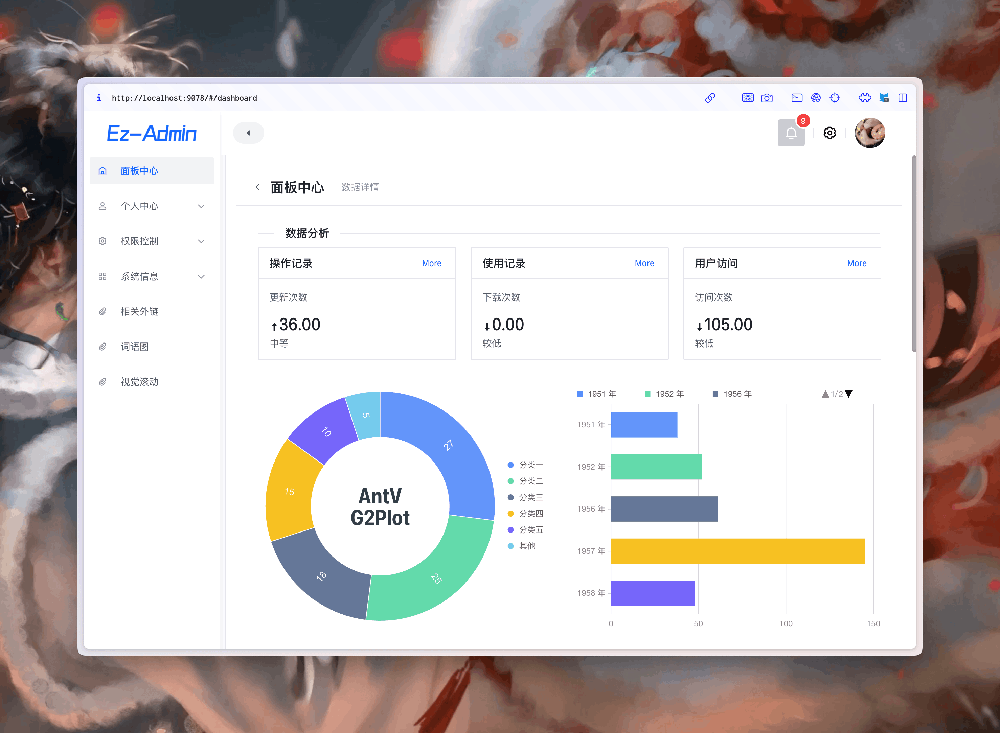
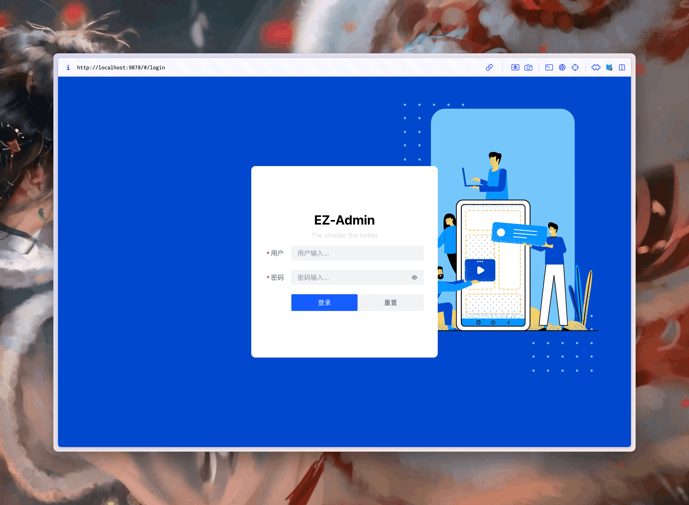

# Ez-Admin

## 项目简介

Ez-Admin 是一款简单的后台管理系统，旨在帮助前端开发者快速搭建一个完整的后台管理平台。尤其适合新人、学生或公司小项目的开发。作为一名业余前端开发者，出于对前端技术的兴趣，我决定自己尝试设计并实现这样一套系统。这不仅帮助我更深入地理解前端技术，还提升了我的开发思维。

我希望这个小系统能帮助新手快速上手后台开发，了解前端技术，并为大家带来一些启发和帮助。

## 功能特点

- **快速搭建**：开箱即用，轻松启动项目。
- **适用对象**：适合前端新人、学生以及公司小项目使用。
- **技术探索**：结合了新技术，尝试了前端的最新趋势。
- **[Demo 预览地址](https://poboll.github.io/ez-admin)**：体验在线演示。
- **[项目文档库](https://poboll.github.io/fast-template-docs/)**：项目文档正在整理中。
- 本项目仅包含前端代码，后端服务已迁移至 [ez-server](https://github.com/poboll/ezadmin-mock)。

## 已知问题

- **移动端适配**：暂未对移动端进行自适应处理。
- **iOS 兼容性**：存在部分 iOS 设备兼容问题。
- **界面缓存策略**：尚未提供界面的缓存策略。

## ⚡️ 技术栈

| 技术               | 描述                                                                 |
| ------------------ | -------------------------------------------------------------------- |
| Vue3.x             | 主流前端框架，Vue 3.x 提供了更高效的响应式系统和 Composition API      |
| Arco-Design        | 字节跳动开源的 UI 组件库，提供了丰富的 UI 组件                        |
| Vue 全家桶         | Vuex、VueRouter 等，构建现代化的前端应用                             |
| axios              | Promise 基础的 HTTP 请求库                                           |
| TypeScript         | JavaScript 的超集，提升代码的可维护性和类型安全性                    |
| Git                | Git 工作流，版本管理工具                                             |

## 编辑器

| 编辑器   | 描述     |
| -------- | -------- |
| Vscode   | 微软出品，支持大量插件的开源代码编辑器 |

## 编辑器插件

| 插件                        | 描述                                   |
| --------------------------- | -------------------------------------- |
| **Atom One Dark Theme**      | 美观的主题，模仿 Atom 编辑器的风格     |
| **Auto Rename Tag**          | 自动重命名 HTML/XML 标签               |
| **Color Highlight**          | 高亮显示颜色代码                       |
| **ESLint**                   | 代码规范检查插件，提高开发效率         |
| **Prettier - Code Formatter**| 自动格式化代码，统一代码风格          |

## 如何启动项目

建议您分别将前端和后端项目克隆到本地：

- [前端部分](https://github.com/poboll/ezadmin)
- [后端部分](https://github.com/poboll/ezadmin-mock)

### 安装依赖

- 前端使用 `yarn` 管理依赖
- 后端使用 `pnpm` 管理依赖

安装完成后，启动前后端项目：

- **前端启动**：`yarn serve` / `pnpm serve` / `npm run serve`
- **后端启动**：`yarn start` / `pnpm start` / `npm start`

### 登录界面

### 进入主体界面

## 项目目标

该项目旨在提供一个简单的后台管理系统模板，适合入门级开发者。欢迎提出问题或建议，帮助项目不断完善。如果您觉得项目对您有所帮助，请给我一个 `star` 支持！ 😄

## ⚡️ 友情链接

- [Vue.js](https://v3.cn.vuejs.org/)
- [AntV G2](https://g2.antv.vision/zh/examples/case/dynamic/#dynamic-bar)
- [Arco Design](https://arco.design/)

## License

[MIT](https://choosealicense.com/licenses/mit/)
